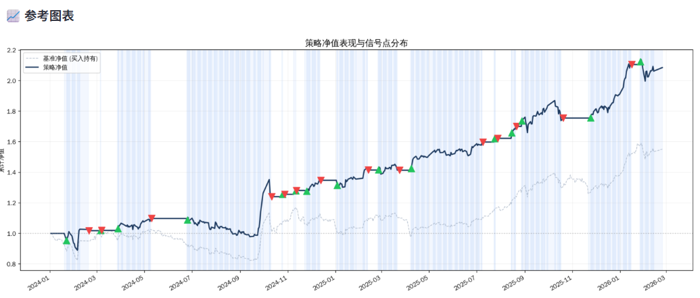

看板固定在了以下网址，目前看来国内可以打开：
https://csi500.streamlit.app/

工作日至固定在了以下网址：
https://worklog.sophiaz.cn/

另外做了一个简易版本的策略说明：

---

## 中证500量化交易策略 · 简明说明

### 一、我们交易什么

我们交易的是**中证500指数**，它代表A股市场中等规模的500家公司的整体表现。我们不挑选个股，只做这一个指数的买卖。

交易方式是全仓进出：要么满仓买入，要么全部卖出，不做半仓。只做多（看涨时买入），不做空。

### 二、策略的核心思路

> **「恐慌时抄底，强势中追涨回调」**

具体来说，系统会在两种情况下自动发出买入信号。

### 三、什么时候买

#### 买入方式一：冰点抄底

当市场跌到极度恐慌的时候，我们果断抄底。

怎么判断极度恐慌？我们看的是中证500的500只股票里，有多少只还在各自短期均线上方。如果这个比例低于16%，意味着绝大多数股票都在下跌，市场已经进入冰点。历史经验告诉我们，这种极端恐慌往往就是阶段性底部。

> 通俗理解：大家都在恐慌割肉的时候，我们反向买入。别人恐惧我贪婪。

#### 买入方式二：首次回调买入

当市场处于上涨趋势中，股价连续涨了至少3天之后，突然出现第一天回调（下跌），我们在这个回调点买入。

但不是随便什么回调都买，系统会同时确认以下几点：

- 大趋势还在——股价仍然在30日均线上方，中期趋势没坏；
- 短期趋势也好——股价在10日均线上方，短期方向向上；
- 有资金支撑——ETF的换手率要够高，说明不是无量下跌；
- 近期有支撑——股价在5日均线上方，跌幅可控。

> 通俗理解：就像一辆加速行驶的车，突然松了一脚油门，我们趁这个喘息的机会跳上车。关键是车本身还在往前跑，不是已经开始倒退了。

### 四、什么时候卖

卖出规则跟买入方式挂钩——不同的买法，对应不同的卖法。

#### 冰点抄底的卖出规则（非常有耐心）

因为冰点抄底是在极端低位买入的，容忍度很高，不轻易卖。只有一个条件触发卖出：

**当市场广度超过79%（绝大多数股票都在涨），同时成交量开始萎缩（涨势后继乏力），此时卖出。**

> 通俗理解：底部买入后一路持有，直到市场从冰点涨到沸点、且涨势已经走弱，才落袋为安。中间不管怎么波动都不动。

#### 首次回调买入的卖出规则（较为严格）

这种买法是追涨性质的，持仓时间较短，卖出条件比较严格。以下任何一种情况出现就卖：

- **市场过热**：市场广度超过79%且成交量萎缩时卖出；
- **趋势走坏 + 当日下跌**：股价跌破了30日均线，而且当天还在继续跌，下行压力明确，赶紧走；
- **趋势走坏 + 持仓太久没赚钱**：股价跌破了30日均线，且已持有5天以上，期间股价从来没有超过买入当天的最高价——说明买入后一直没涨起来，时间止损走人。

> 通俗理解：追涨买入本质上是短线操作，一旦发现趋势不对就要果断止损。但也不是稍微跌一点就跑——需要确认趋势确实走坏了才卖出。

### 五、一个特殊机制

如果我们本来是因为回调买入进场的，但买入之后市场突然暴跌，跌到了冰点（广度低于16%），系统会自动把这笔交易从"回调买入"升级为"冰点抄底"。

这样就会使用更宽松、更有耐心的卖出规则，而不是用严格的止损规则把仓位割在底部。

### 六、交易成本和执行方式

- 每次买入或卖出，按总金额的千分之一（0.1%）计算交易成本，包含佣金和滑点；
- 今天发出的信号，第二天才执行（实际交易中不可能收盘后当天成交）；
- 不加杠杆，不融资融券，用多少资金买多少。

### 七、策略的特点总结

- **兼顾两种市场行情**：极端恐慌时能抓住底部机会，正常上涨趋势中也能参与波段；
- **纪律严明**：全部由程序自动判断，不受人为情绪影响，不会恐慌割肉，也不会贪心不卖；
- **风险可控**：有明确的卖出规则和时间止损机制，不会无限期扛亏损；
- **简单直接**：只做一个指数，全仓进出，逻辑清晰透明。

### 八、策略表现

从2024年1月1日至今的结果表现如下：

- 深色曲线是策略表现；
- 浅色曲线是中证500指数本身；
- 绿色箭头代表买入；
- 红色箭头代表卖出。

